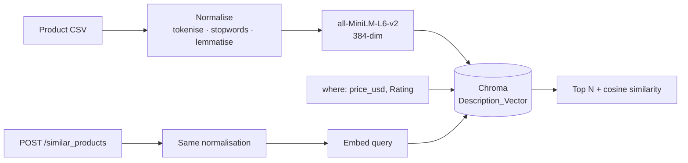

# 🔍 Product Similarity API

**Semantic product search over descriptions — ask in plain language, filtered by price and rating inside the vector query.**

[](https://python.org)
[](https://fastapi.tiangolo.com)
[](https://trychroma.com)
[](LICENSE)
[](https://github.com/MohanVishe/product-similarity-api/actions/workflows/ci.yml)

---

## The problem

Keyword search on a product catalogue fails the moment a shopper doesn't use your vocabulary. Someone searching *"laptop for design work"* gets nothing if your listing says *"high-performance notebook with a colour-accurate display"* — the intent matches perfectly, the words don't overlap at all.

This service searches on **meaning** instead. Product descriptions are embedded into a vector space, a query is embedded the same way, and the nearest neighbours come back from among the products that satisfy the price and rating filters.

## How it works



**The one thing worth pointing at:** query text and document text go through *the same* normalisation function ([`preprocess.py`](preprocess.py)). Embedding a raw query against preprocessed documents is a classic quiet failure — it doesn't error, it just returns slightly worse results forever, and nobody notices because the output still looks reasonable.

| Stage | Choice | Reasoning |
|---|---|---|
| Embedded field | Description, not name | Names are 2–3 words and carry almost no semantic signal. The description is where the meaning lives. |
| Embedding model | `all-MiniLM-L6-v2` | 384-dim, runs locally, no API cost. Sufficient for a single-catalogue corpus. |
| Vector store | Chroma | Runs locally with one command. No managed-service dependency for a demo. |
| Preprocessing | Tokenise → stopwords (negations kept) → lemmatise → lowercase | Reduces vocabulary variance so *"running shoes"* and *"shoe for runners"* land closer together — while *"not a laptop"* stays *"not laptop"*. |
| Filtering | Inside the query (Chroma `where`) | Price is stored as a number at ingest, so price and rating constrain the search itself. A product in range can never be lost for sitting outside a fixed candidate window. |
| Distance | Cosine | Each result carries its `similarity`, so a caller can see how close the match really is. |

---

## API

### `POST /similar_products`

```bash
curl -X POST http://localhost:8080/similar_products \
  -H "Content-Type: application/json" \
  -H "token: your-api-token" \
  -d '{
    "name": "something for working from home",
    "min_price": 100,
    "max_price": 1200,
    "min_rating": 4.0,
    "limit": 3
  }'
```

| Field | Type | Default | |
|---|---|---|---|
| `name` | string | — | **required.** Natural-language query |
| `min_price` / `max_price` | int | `0` / `10000` | Inclusive bounds |
| `min_rating` / `max_rating` | float | `0.0` / `5.0` | Inclusive bounds |
| `limit` | int | `3` | 1–20 |
| `min_similarity` | float | none | Optional cut-off on cosine similarity |

`min_price > max_price` (or the same for rating) returns `422`.

Response from the bundled catalogue (descriptions shortened):

```json
{
  "query": "something for working from home",
  "count": 3,
  "results": [
    { "Product Name": "Laptop",       "Price": "$999", "Category": "Electronics",        "Rating": 4.5, "similarity": 0.247, "Description": "The new XYZ laptop is perfect for both work and play..." },
    { "Product Name": "Coffee Maker", "Price": "$129", "Category": "Kitchen Appliances", "Rating": 4.3, "similarity": 0.218, "Description": "Start your day right with our state-of-the-art coffee maker..." },
    { "Product Name": "Cookware Set", "Price": "$149", "Category": "Kitchenware",        "Rating": 4.6, "similarity": 0.187, "Description": "Cook like a pro with our premium cookware set..." }
  ]
}
```

**Auth:** a shared secret in the `token` header. `401` otherwise.

### `GET /health`

```json
{ "status": "ok", "collection": "Description_Vector", "documents": 16 }
```

Interactive docs at **`/docs`** once the server is running — FastAPI generates them from the Pydantic models.

---

## Run it

```bash
git clone https://github.com/MohanVishe/product-similarity-api.git
cd product-similarity-api

python -m venv venv
source venv/bin/activate          # Windows: venv\Scripts\activate
pip install -r requirements.txt   # tested on Python 3.11

cp .env.example .env              # set API_TOKEN
```

**1. Start Chroma**

```bash
chroma run --path ./chroma-data --port 8000
```

**2. Index the catalogue** (once; `--reset` rebuilds it)

```bash
python ingest.py --reset
```

**3. Serve**

```bash
uvicorn app:app --reload --port 8080
```

### Tests and the retrieval eval

Neither needs a Chroma server: both index the catalogue into an in-process Chroma.

```bash
pip install -r requirements-dev.txt   # requirements.txt + pytest
pytest -q
python -m evals.run_eval              # rewrites evals/results.json and evals/RESULTS.md
python -m evals.run_eval --check      # fails if the numbers drift from the committed files
```

CI ([`.github/workflows/ci.yml`](.github/workflows/ci.yml)) installs the exact versions in `requirements-lock.txt` (Linux, Python 3.11, CPU-only torch) with `uv pip sync requirements-lock.txt --index-strategy unsafe-best-match`, then runs `pytest` and the eval in `--check` mode.

### With Docker

```bash
docker build -t product-similarity-api .
docker run -p 8080:8080 --env-file .env -e CHROMA_HOST=host.docker.internal product-similarity-api
```

---

## Layout

```
├── app.py                 # FastAPI app — endpoints, auth, request validation
├── retrieval.py           # indexing, where-clause, search: shared by API, ingest and eval
├── ingest.py              # CSV → Chroma, run once
├── preprocess.py          # normalisation shared by indexing and querying
├── evals/
│   ├── queries.json       # 40 labelled queries
│   ├── run_eval.py        # runs them through retrieval.search, writes the two files below
│   ├── scoring.py         # recall@k, MRR, false-positive rate, floor sweep
│   ├── results.json
│   └── RESULTS.md
├── tests/                 # pytest, incl. TestClient against an in-process Chroma
├── data/
│   ├── Generated_Product_Data.csv
│   └── DataGenerator.ipynb
├── notebooks/
│   └── research.ipynb     # exploration behind the approach
├── Dockerfile
├── requirements.txt       # direct dependencies, pinned
├── requirements-dev.txt   # + pytest
└── requirements-lock.txt  # full lock used by CI
```

---

## Measured retrieval quality

From [`evals/RESULTS.md`](evals/RESULTS.md), generated by `python -m evals.run_eval` and checked in CI. **n = 40 queries** over the 16 products: 16 paraphrases that avoid the product's own words, 5 multi-product intents, 6 negations, 6 filter-constrained queries and 7 off-topic queries. I wrote the queries and the relevance judgments from the product rows; each query goes through `retrieval.search`, the same function `/similar_products` calls.

At the API defaults (`limit` 3, no `min_similarity`), over the 32 queries that have a correct answer:

| recall@1 | recall@3 | recall@5 | MRR |
|---|---|---|---|
| 0.750 | 0.958 | 0.969 | 0.922 |

recall@1 is capped at 1/*n* for a query with *n* correct products, so MRR is the better single number. By type: paraphrases put the right product first 16 of 16 times (MRR 1.000); intents 1.000, filtered 0.833, negations 0.700.

**Off-topic queries.** With no floor, all 7 return three products. Best off-topic score: 0.216; weakest correct first hit: 0.247.

| `min_similarity` | recall@3 | on-topic queries returning nothing | off-topic queries returning something |
|---|---|---|---|
| none | 0.958 | 0 of 32 | 7 of 7 |
| 0.20 | 0.958 | 0 of 32 | 2 of 7 |
| 0.25 | 0.911 | 1 of 32 | 0 of 7 |
| 0.30 | 0.854 | 2 of 32 | 0 of 7 |

The full sweep is in [`evals/RESULTS.md`](evals/RESULTS.md). **The API keeps no default floor.** 0.20 keeps every correct top-3 result on this set and cuts off-topic false positives from 7 of 7 to 2 of 7. 0.25 is what a rule fixed before the sweep picks (the lowest false-positive rate for at most 0.05 recall@3 lost), and it removes them all, but it returns nothing for this README's own example query (best score 0.247). The two groups sit 0.03 apart, and any floor read off this table is tuned on the queries it is scored on, so the floor stays a caller setting. 0.20 is a reasonable starting point for this catalogue.

**Negation.** Preprocessing keeps *not*, but the embedding model does not act on it: for 4 of the 5 negation queries that rule a product out, that product comes back first (*"not a laptop"* → Laptop, 0.461).

**Preprocessing vs raw text.** The same eval with no normalisation gives recall@1 0.734, recall@3 0.943, MRR 0.922, within one query of the pipeline above. At this size the normalisation neither helps nor hurts measurably.

---

## Limitations

- **The catalogue is synthetic and small.** `data/Generated_Product_Data.csv` holds 16 generated products with clean, well-written descriptions. Real catalogue text is messy, inconsistent and often near-duplicated across listings. With 16 items, every query returns something — the best match for *"something for working from home"* scores a cosine similarity of 0.247 — which is why each result carries its score.
- **The eval is small and author-written.** 40 queries, binary judgments by one person, no held-out split. The paraphrase set is easy on a catalogue this distinct. The numbers above describe this catalogue and query set; they are not a general retrieval benchmark.
- **`min_similarity` has no default.** On this set, off-topic and on-topic scores are only 0.03 apart, so no floor separates them cleanly (see above); it is the caller's choice.
- **Negation is not understood by the model.** Keeping *not* in the text is necessary but not sufficient; a query that rules a product out usually gets that product first.
- **Auth is a shared secret in a header.** Adequate for a demo — no rotation, no per-client identity, no rate limiting.
- **Re-indexing is full only.** `ingest.py` has no incremental update path.

## Next

1. A held-out query set, written by someone other than the author and ideally from real search logs, to set a default `min_similarity` without tuning on the scored queries.
2. Handle negation explicitly: parse *"not X"* into an exclusion and drop X's products from the results, measured against the negation queries in `evals/queries.json`.
3. Hybrid retrieval — BM25 alongside dense — so exact model numbers and brand names still match.
4. A larger, messier catalogue, where the eval can separate embedding models and preprocessing choices.
5. Currency as a structured field alongside the numeric price.
6. Per-client API keys with rate limiting.

## License

MIT — see [LICENSE](LICENSE).
