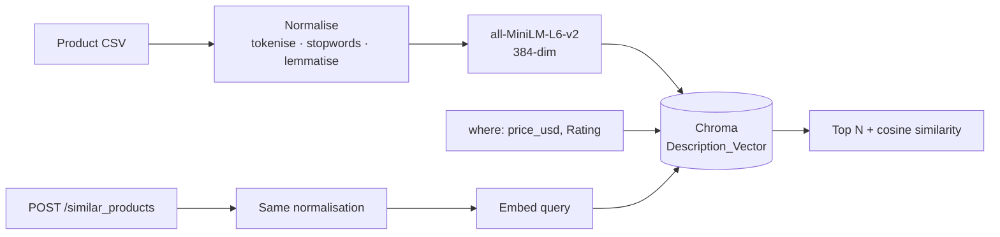

# 🔍 Product Similarity API

**Semantic product search over descriptions — ask in plain language, filtered by price and rating inside the vector query.**

[](https://python.org)
[](https://fastapi.tiangolo.com)
[](https://trychroma.com)
[](LICENSE)

---

## The problem

Keyword search on a product catalogue fails the moment a shopper doesn't use your vocabulary. Someone searching *"laptop for design work"* gets nothing if your listing says *"high-performance notebook with a colour-accurate display"* — the intent matches perfectly, the words don't overlap at all.

This service searches on **meaning** instead. Product descriptions are embedded into a vector space, a query is embedded the same way, and the nearest neighbours come back from among the products that satisfy the price and rating filters.

## How it works



**The one thing worth pointing at:** query text and document text go through *the same* normalisation function ([`preprocess.py`](preprocess.py)). Embedding a raw query against preprocessed documents is a classic quiet failure — it doesn't error, it just returns slightly worse results forever, and nobody notices because the output still looks reasonable.

| Stage | Choice | Reasoning |
|---|---|---|
| Embedded field | Description, not name | Names are 2–3 words and carry almost no semantic signal. The description is where the meaning lives. |
| Embedding model | `all-MiniLM-L6-v2` | 384-dim, runs locally, no API cost. Sufficient for a single-catalogue corpus. |
| Vector store | Chroma | Runs locally with one command. No managed-service dependency for a demo. |
| Preprocessing | Tokenise → stopwords (negations kept) → lemmatise → lowercase | Reduces vocabulary variance so *"running shoes"* and *"shoe for runners"* land closer together — while *"not a laptop"* stays *"not laptop"*. |
| Filtering | Inside the query (Chroma `where`) | Price is stored as a number at ingest, so price and rating constrain the search itself. A product in range can never be lost for sitting outside a fixed candidate window. |
| Distance | Cosine | Each result carries its `similarity`, so a caller can see how close the match really is. |

---

## API

### `POST /similar_products`

```bash
curl -X POST http://localhost:8080/similar_products \
  -H "Content-Type: application/json" \
  -H "token: your-api-token" \
  -d '{
    "name": "something for working from home",
    "min_price": 100,
    "max_price": 1200,
    "min_rating": 4.0,
    "limit": 3
  }'
```

| Field | Type | Default | |
|---|---|---|---|
| `name` | string | — | **required.** Natural-language query |
| `min_price` / `max_price` | int | `0` / `10000` | Inclusive bounds |
| `min_rating` / `max_rating` | float | `0.0` / `5.0` | Inclusive bounds |
| `limit` | int | `3` | 1–20 |
| `min_similarity` | float | none | Optional cut-off on cosine similarity |

`min_price > max_price` (or the same for rating) returns `422`.

Response from the bundled catalogue (descriptions shortened):

```json
{
  "query": "something for working from home",
  "count": 3,
  "results": [
    { "Product Name": "Laptop",       "Price": "$999", "Category": "Electronics",        "Rating": 4.5, "similarity": 0.247, "Description": "The new XYZ laptop is perfect for both work and play..." },
    { "Product Name": "Coffee Maker", "Price": "$129", "Category": "Kitchen Appliances", "Rating": 4.3, "similarity": 0.218, "Description": "Start your day right with our state-of-the-art coffee maker..." },
    { "Product Name": "Cookware Set", "Price": "$149", "Category": "Kitchenware",        "Rating": 4.6, "similarity": 0.187, "Description": "Cook like a pro with our premium cookware set..." }
  ]
}
```

**Auth:** a shared secret in the `token` header. `401` otherwise.

### `GET /health`

```json
{ "status": "ok", "collection": "Description_Vector", "documents": 16 }
```

Interactive docs at **`/docs`** once the server is running — FastAPI generates them from the Pydantic models.

---

## Run it

```bash
git clone https://github.com/MohanVishe/product-similarity-api.git
cd product-similarity-api

python -m venv venv
source venv/bin/activate          # Windows: venv\Scripts\activate
pip install -r requirements.txt   # tested on Python 3.11

cp .env.example .env              # set API_TOKEN
```

**1. Start Chroma**

```bash
chroma run --path ./chroma-data --port 8000
```

**2. Index the catalogue** (once; `--reset` rebuilds it)

```bash
python ingest.py --reset
```

**3. Serve**

```bash
uvicorn app:app --reload --port 8080
```

### With Docker

```bash
docker build -t product-similarity-api .
docker run -p 8080:8080 --env-file .env -e CHROMA_HOST=host.docker.internal product-similarity-api
```

---

## Layout

```
├── app.py              # FastAPI app — endpoints, auth, filtered vector query
├── ingest.py           # CSV → Chroma, run once
├── preprocess.py       # normalisation shared by indexing and querying
├── data/
│   ├── Generated_Product_Data.csv
│   └── DataGenerator.ipynb
├── notebooks/
│   └── research.ipynb  # exploration behind the approach
├── Dockerfile
└── requirements.txt
```

---

## Limitations

- **The catalogue is synthetic and small.** `data/Generated_Product_Data.csv` holds 16 generated products with clean, well-written descriptions. Real catalogue text is messy, inconsistent and often near-duplicated across listings. With 16 items, every query returns something — the best match for *"something for working from home"* scores a cosine similarity of 0.247 — which is why each result carries its score.
- **`min_similarity` has no default.** A sensible cut-off depends on the catalogue and has to be set against labelled queries, not guessed; until then it is the caller's choice.
- **Auth is a shared secret in a header.** Adequate for a demo — no rotation, no per-client identity, no rate limiting.
- **Re-indexing is full only.** `ingest.py` has no incremental update path.

## Next

1. A labelled set of query → expected-product pairs, measuring recall@k — so model and preprocessing changes are compared, not eyeballed, and `min_similarity` gets a calibrated default.
2. Hybrid retrieval — BM25 alongside dense — so exact model numbers and brand names still match.
3. Currency as a structured field alongside the numeric price.
4. Per-client API keys with rate limiting.

## License

MIT — see [LICENSE](LICENSE).
