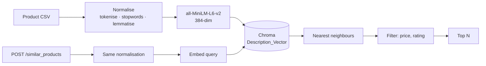

# 🔍 Product Similarity API

**Semantic product search over descriptions — ask in plain language, filter by price and rating.**

[](https://python.org)
[](https://fastapi.tiangolo.com)
[](https://trychroma.com)
[](LICENSE)

---

## The problem

Keyword search on a product catalogue fails the moment a shopper doesn't use your vocabulary. Someone searching *"laptop for design work"* gets nothing if your listing says *"high-performance notebook with a colour-accurate display"* — the intent matches perfectly, the words don't overlap at all.

This service searches on **meaning** instead. Product descriptions are embedded into a vector space, a query is embedded the same way, and the nearest neighbours come back — then price and rating narrow the result.

## How it works



**The one thing worth pointing at:** query text and document text go through *the same* normalisation function ([`preprocess.py`](preprocess.py)). Embedding a raw query against preprocessed documents is a classic quiet failure — it doesn't error, it just returns slightly worse results forever, and nobody notices because the output still looks reasonable.

| Stage | Choice | Reasoning |
|---|---|---|
| Embedded field | Description, not name | Names are 2–3 words and carry almost no semantic signal. The description is where the meaning lives. |
| Embedding model | `all-MiniLM-L6-v2` | 384-dim, runs locally, no API cost. Sufficient for a single-catalogue corpus. |
| Vector store | Chroma | Runs locally with one command. No managed-service dependency for a demo. |
| Preprocessing | Tokenise → stopwords → lemmatise → lowercase | Reduces vocabulary variance so *"running shoes"* and *"shoe for runners"* land closer together. |
| Filtering | After retrieval | Simple, and it keeps the vector query unconstrained — but it has a real consequence, see [Limitations](#limitations). |

---

## API

### `POST /similar_products`

```bash
curl -X POST http://localhost:8080/similar_products \
  -H "Content-Type: application/json" \
  -H "token: your-api-token" \
  -d '{
    "name": "something for working from home",
    "min_price": 100,
    "max_price": 1200,
    "min_rating": 4.0,
    "limit": 3
  }'
```

| Field | Type | Default | |
|---|---|---|---|
| `name` | string | — | **required.** Natural-language query |
| `min_price` / `max_price` | int | `0` / `10000` | Inclusive bounds |
| `min_rating` / `max_rating` | float | `0.0` / `5.0` | Inclusive bounds |
| `limit` | int | `3` | 1–20 |

```json
{
  "query": "something for working from home",
  "count": 2,
  "results": [
    {
      "Product Name": "Laptop",
      "Description": "The new XYZ laptop is perfect for both work and play...",
      "Price": "$999",
      "Category": "Electronics",
      "Rating": 4.5
    }
  ]
}
```

**Auth:** a shared secret in the `token` header. `401` otherwise.

### `GET /health`

```json
{ "status": "ok", "collection": "Description_Vector", "documents": 20 }
```

Interactive docs at **`/docs`** once the server is running — FastAPI generates them from the Pydantic models.

---

## Run it

```bash
git clone https://github.com/MohanVishe/product-similarity-api.git
cd product-similarity-api

python -m venv venv
source venv/bin/activate          # Windows: venv\Scripts\activate
pip install -r requirements.txt

cp .env.example .env              # set API_TOKEN
```

**1. Start Chroma**

```bash
chroma run --path ./chroma-data --port 8000
```

**2. Index the catalogue** (once)

```bash
python ingest.py
```

**3. Serve**

```bash
uvicorn app:app --reload --port 8080
```

### With Docker

```bash
docker build -t product-similarity-api .
docker run -p 8080:8080 --env-file .env -e CHROMA_HOST=host.docker.internal product-similarity-api
```

---

## Layout

```
├── app.py              # FastAPI app — endpoints, auth, filtering
├── ingest.py           # CSV → Chroma, run once
├── preprocess.py       # normalisation shared by indexing and querying
├── data/
│   ├── Generated_Product_Data.csv
│   └── DataGenerator.ipynb
├── notebooks/
│   └── research.ipynb  # exploration behind the approach
├── Dockerfile
└── requirements.txt
```

---

## Limitations

- **The catalogue is synthetic.** `data/Generated_Product_Data.csv` was generated, not scraped — it's a small set of clean, well-written descriptions. Real catalogue text is messy, inconsistent and often near-duplicated across listings, and retrieval quality on real data would be meaningfully worse. Stated plainly because a demo on ideal data proves less than it appears to.
- **Filter-after-retrieval has a real failure mode.** A product that matches your price range perfectly but sits outside the nearest-neighbour window will never be returned. Chroma supports metadata filtering inside the query (`where={...}`); moving price and rating in there would fix this and is the first improvement worth making.
- **Auth is a shared secret in a header.** Adequate for a demo, not for anything real — no rotation, no per-client identity, no rate limiting.
- **Price is parsed out of a string** (`"$999"` → `999`). Currency and decimals should be structured fields, not formatted text.
- **No evaluation.** There is no labelled set of query → expected-product pairs, so "the results look reasonable" is an observation and not a measurement.
- **Re-indexing is full only.** `ingest.py` has no incremental update path.

## What I'd do differently

1. Push price and rating into Chroma's `where` clause so filtering happens during retrieval, not after it
2. Store price as an integer and currency as a separate field at ingest time
3. Build a small labelled evaluation set and measure recall@k, so changes to the model or preprocessing can be compared instead of eyeballed
4. Hybrid retrieval — BM25 alongside dense — so exact model numbers and brand names still match
5. Proper auth: API keys per client, with rate limiting

## License

MIT — see [LICENSE](LICENSE).
