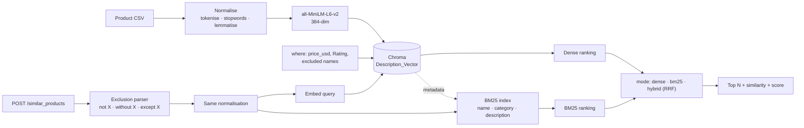

# 🔍 Product Similarity API

**Product search over descriptions — by meaning, by keyword, or both — with price, rating and *"not X"* exclusions applied inside the query.**

[](https://python.org)
[](https://fastapi.tiangolo.com)
[](https://trychroma.com)
[](LICENSE)
[](https://github.com/MohanVishe/product-similarity-api/actions/workflows/ci.yml)

---

## The problem

Keyword search on a product catalogue fails the moment a shopper doesn't use your vocabulary. Someone searching *"laptop for design work"* gets nothing if your listing says *"high-performance notebook with a colour-accurate display"* — the intent matches perfectly, the words don't overlap at all.

This service searches on **meaning** instead. Product descriptions are embedded into a vector space, a query is embedded the same way, and the nearest neighbours come back from among the products that satisfy the price and rating filters. A BM25 keyword ranking is available alongside it (or fused with it), and a query that rules something out (*"fitness gear, not shoes"*) has that product filtered out rather than embedded.

## How it works



**The one thing worth pointing at:** query text and document text go through *the same* normalisation function ([`preprocess.py`](preprocess.py)). Embedding a raw query against preprocessed documents is a classic quiet failure — it doesn't error, it just returns slightly worse results forever, and nobody notices because the output still looks reasonable.

| Stage | Choice | Reasoning |
|---|---|---|
| Embedded field | Description, not name | Names are 2–3 words and carry almost no semantic signal. The description is where the meaning lives. |
| Embedding model | `all-MiniLM-L6-v2` | 384-dim, runs locally, no API cost. Sufficient for a single-catalogue corpus. |
| Vector store | Chroma | Runs locally with one command. No managed-service dependency for a demo. |
| Preprocessing | Tokenise → stopwords (negations kept) → lemmatise → lowercase | Reduces vocabulary variance so *"running shoes"* and *"shoe for runners"* land closer together — while *"not a laptop"* stays *"not laptop"*. |
| Filtering | Inside the query (Chroma `where`) | Price is stored as a number at ingest, so price and rating constrain the search itself. A product in range can never be lost for sitting outside a fixed candidate window. Excluded products go into the same `where`. |
| Keyword ranking | BM25 ([`rank-bm25`](https://github.com/dorianbrown/rank_bm25)) over name + category + description | Matches the words themselves (brand names, category words) with the same normalisation. Built from the collection's own metadata, so there is no second copy of the data. |
| Fusion (`hybrid`) | Reciprocal rank fusion, k = 60 | Rank-based, so cosine and BM25 scales never have to be reconciled. k is the value from Cormack, Clarke & Büttcher (SIGIR 2009), not tuned here. |
| Negation | Parsed into an exclusion filter ([`exclusions.py`](exclusions.py)) | The embedding model ignores *not*. A *"not X"*, *"without X"*, *"except X"*, *"excluding X"*, *"other than X"* or *"no X"* whose words all appear in a product's name or category removes that product, and the phrase leaves the searched text. |
| Distance | Cosine | Each result carries its `similarity`, so a caller can see how close the match really is. |

---

## API

### `POST /similar_products`

```bash
curl -X POST http://localhost:8080/similar_products \
  -H "Content-Type: application/json" \
  -H "token: your-api-token" \
  -d '{
    "name": "something for working from home",
    "min_price": 100,
    "max_price": 1200,
    "min_rating": 4.0,
    "limit": 3
  }'
```

| Field | Type | Default | |
|---|---|---|---|
| `name` | string | — | **required.** Natural-language query |
| `min_price` / `max_price` | int | `0` / `10000` | Inclusive bounds |
| `min_rating` / `max_rating` | float | `0.0` / `5.0` | Inclusive bounds |
| `limit` | int | `3` | 1–20 |
| `min_similarity` | float | none | Optional cut-off on cosine similarity |
| `mode` | `"dense"` \| `"bm25"` \| `"hybrid"` | `"dense"` | Embeddings, keywords, or both fused by reciprocal rank |
| `exclusions` | bool | `true` | Turn *"not X"* / *"without X"* / *"except X"* naming a product or category into a filter |

`min_price > max_price` (or the same for rating), or an unknown `mode`, returns `422`. A request with only the original fields behaves as before, except that exclusions are now parsed; `"exclusions": false` switches that off.

Response from the bundled catalogue (descriptions shortened):

```json
{
  "query": "something for working from home",
  "mode": "dense",
  "excluded": [],
  "count": 3,
  "results": [
    { "Product Name": "Laptop",       "Price": "$999", "Category": "Electronics",        "Rating": 4.5, "similarity": 0.247, "score": 0.247, "Description": "The new XYZ laptop is perfect for both work and play..." },
    { "Product Name": "Coffee Maker", "Price": "$129", "Category": "Kitchen Appliances", "Rating": 4.3, "similarity": 0.218, "score": 0.218, "Description": "Start your day right with our state-of-the-art coffee maker..." },
    { "Product Name": "Cookware Set", "Price": "$149", "Category": "Kitchenware",        "Rating": 4.6, "similarity": 0.187, "score": 0.187, "Description": "Cook like a pro with our premium cookware set..." }
  ]
}
```

`similarity` is always the cosine similarity, and `min_similarity` always filters on it. `score` is what the chosen `mode` ranked by: the cosine in `dense`, the BM25 score in `bm25`, the reciprocal-rank-fusion score in `hybrid`. In `bm25` mode only products that share at least one word with the query come back.

**Exclusions.** `{"name": "not a laptop", "mode": "hybrid"}` returns `"excluded": ["Laptop"]` and Backpack, Smartphone, Wireless Headphones; with `"exclusions": false` the laptop comes first (0.461). The parser is deliberately literal:

- The phrase after the trigger runs to the next comma or clause word (*but, and, that, with, for…*); it excludes a product only if **every** word of it is a word of that product's name or category. *"a yoga mat"* → Yoga Mat, *"shoes"* → Running Shoes, *"electronics"* → the whole category.
- **Not exclusions:** hedges (*"not too expensive"*, *"not just a phone"*) and phrases that name no product (*"headphones that are not wired"*). They leave the query exactly as typed. This is the false-positive decision: when unsure, the parser does nothing, so a miss falls back to the old behaviour instead of removing a product the shopper wanted.
- No synonyms: *"not a phone"* does not exclude the Smartphone.

**Auth:** a shared secret in the `token` header. `401` otherwise.

### `GET /health`

```json
{ "status": "ok", "collection": "Description_Vector", "documents": 16 }
```

Interactive docs at **`/docs`** once the server is running — FastAPI generates them from the Pydantic models.

---

## Run it

```bash
git clone https://github.com/MohanVishe/product-similarity-api.git
cd product-similarity-api

python -m venv venv
source venv/bin/activate          # Windows: venv\Scripts\activate
pip install -r requirements.txt   # tested on Python 3.11

cp .env.example .env              # set API_TOKEN
```

**1. Start Chroma**

```bash
chroma run --path ./chroma-data --port 8000
```

**2. Index the catalogue** (once; `--reset` rebuilds it)

```bash
python ingest.py --reset
```

**3. Serve**

```bash
uvicorn app:app --reload --port 8080
```

### Tests and the retrieval eval

Neither needs a Chroma server: both index the catalogue into an in-process Chroma.

```bash
pip install -r requirements-dev.txt   # requirements.txt + pytest
pytest -q
python -m evals.run_eval              # rewrites evals/results.json and evals/RESULTS.md
python -m evals.run_eval --check      # fails if the numbers drift from the committed files
python -m evals.run_eval --only dev   # print one set's numbers, write nothing
```

CI ([`.github/workflows/ci.yml`](.github/workflows/ci.yml)) installs the exact versions in `requirements-lock.txt` (Linux, Python 3.11, CPU-only torch) with `uv pip sync requirements-lock.txt --index-strategy unsafe-best-match`, then runs `pytest` and the eval in `--check` mode.

### With Docker

```bash
docker build -t product-similarity-api .
docker run -p 8080:8080 --env-file .env -e CHROMA_HOST=host.docker.internal product-similarity-api
```

---

## Layout

```
├── app.py                 # FastAPI app — endpoints, auth, request validation
├── retrieval.py           # indexing, where-clause, dense/BM25/hybrid search: shared by API, ingest and eval
├── exclusions.py          # "not X" / "without X" / "except X" -> excluded products
├── ingest.py              # CSV → Chroma, run once
├── preprocess.py          # normalisation shared by indexing and querying
├── evals/
│   ├── queries.json       # dev set: 40 labelled queries
│   ├── queries-heldout.json  # held-out set: 34 queries, committed before the hybrid/exclusion code
│   ├── run_eval.py        # runs both through retrieval.search_detailed per mode, writes the two files below
│   ├── scoring.py         # recall@k, MRR, negation accuracy, false-positive rate, floor sweep
│   ├── results.json
│   └── RESULTS.md
├── tests/                 # pytest, incl. TestClient against an in-process Chroma
├── data/
│   ├── Generated_Product_Data.csv
│   └── DataGenerator.ipynb
├── notebooks/
│   └── research.ipynb     # exploration behind the approach
├── Dockerfile
├── requirements.txt       # direct dependencies, pinned
├── requirements-dev.txt   # + pytest
└── requirements-lock.txt  # full lock used by CI
```

---

## Measured retrieval quality

From [`evals/RESULTS.md`](evals/RESULTS.md), generated by `python -m evals.run_eval` and checked in CI. Every query goes through `retrieval.search_detailed`, the function `/similar_products` calls. I wrote both query sets and their relevance judgments from the product rows:

- **Dev set**: the original 40 queries (16 paraphrases, 5 multi-product intents, 6 negations, 6 filtered, 7 off-topic). Its findings (negation ignored, no clean floor) are what the changes below were designed from, so after-numbers on it are **in-sample**.
- **Held-out set**: 34 new queries (8 brand names or distinctive listing words, 5 paraphrases, 9 negations, 4 hedges such as *"a watch that is not too expensive"*, 3 filtered, 5 off-topic), committed ([08efe32](https://github.com/MohanVishe/product-similarity-api/commit/08efe32)) before any hybrid or exclusion code existed and **scored once** after it.

At the API defaults (`limit` 3, no `min_similarity`):

| set | configuration | recall@1 | recall@3 | MRR | negation accuracy |
|---|---|---|---|---|---|
| dev | before: dense | 0.750 | 0.958 | 0.922 | 0.000 (0 of 5) |
| dev | **after: dense + exclusions (default)** | 0.781 | 0.958 | 0.938 | 0.800 (4 of 5) |
| held-out | before: dense | 0.661 | 0.881 | 0.809 | 0.000 (0 of 9) |
| held-out | **after: dense + exclusions (default)** | 0.798 | 0.887 | 0.905 | 1.000 (9 of 9) |
| held-out | bm25 + exclusions | 0.809 | 0.929 | 0.911 | 1.000 |
| held-out | hybrid + exclusions | 0.809 | 0.964 | 0.928 | 1.000 |

Negation accuracy is the share of negation queries with no ruled-out product in the top 3. recall@1 is capped at 1/*n* for a query with *n* correct products, so MRR is the better single number. Every mode, with and without exclusions, is in [`evals/RESULTS.md`](evals/RESULTS.md).

**Exclusions.** With the parser on, the ruled-out product leaves the top 3 in 9 of 9 held-out negation queries, and in 4 of 5 on dev. The dev miss is *"electronics but not a phone"*: "phone" is not a word of "Smartphone", and the parser uses no synonyms. On both sets it excluded a product labelled relevant in 0 queries, and it left all 4 held-out hedges untouched. Ranking what remains is the open part: 2 held-out negation queries still miss their answer in the top 3 (*"home workout equipment other than dumbbells"*, *"a travel accessory but not a backpack"*).

**Dense vs BM25 vs hybrid.** The default mode came from a rule fixed before the dev run: hybrid, unless it lowers dev MRR or recall@3 below dense. On dev it lowered MRR (0.922 vs 0.938, both with exclusions), because BM25 promotes products that share generic words such as *"gear"* or *"home"* in the intent queries. So **dense stays the default** and `mode` is a request option; the eval fails if the constant and the rule disagree. On the held-out set hybrid + exclusions scored higher (recall@3 0.964 vs 0.887, MRR 0.928 vs 0.905), mostly on negation and category-word queries. That difference comes from a handful of queries, and switching the default because of it would tune on the held-out set, so the switch waits for a fresh set (see Next). The brand-name queries BM25 is usually added for did not separate the modes here: dense ranked the right product first for all 8 (*"XYZ"*, *"hypoallergenic"*, *"storage rack"*…) on this 16-product catalogue.

**Off-topic queries and `min_similarity`.** No score separates them cleanly on either set, the fused one included. On held-out, the best off-topic result outscores the weakest correct first hit on cosine (0.258 vs 0.226), on BM25 (2.387 vs 1.044) and on the RRF score (0.033 vs 0.015). The worst case is *"ABC news live stream"*, which shares the smartphone's brand word. `bm25` mode returns nothing when no word is shared, which cuts off-topic results (1 of 7 on dev, 3 of 5 on held-out, against all of them for dense) at a cost in recall (dev recall@3 0.771). **The API keeps no default floor.** 0.20 is a reasonable caller-side start for this catalogue: on dev it loses no recall@3 and cuts off-topic results from 7 of 7 to 2 of 7; on held-out it also loses none and cuts 5 of 5 to 2 of 5.

| `min_similarity` (dense + exclusions) | dev recall@3 | dev off-topic returning something | held-out recall@3 | held-out off-topic returning something |
|---|---|---|---|---|
| none | 0.958 | 7 of 7 | 0.887 | 5 of 5 |
| 0.20 | 0.958 | 2 of 7 | 0.887 | 2 of 5 |
| 0.25 | 0.911 | 0 of 7 | 0.851 | 1 of 5 |
| 0.30 | 0.854 | 0 of 7 | 0.804 | 0 of 5 |

**Preprocessing vs raw text.** On dev with the pre-change pipeline, no normalisation gives recall@1 0.734, recall@3 0.943, MRR 0.922, within one query of the normalised pipeline. At this size the normalisation neither helps nor hurts measurably.

---

## Limitations

- **The catalogue is synthetic and small.** `data/Generated_Product_Data.csv` holds 16 generated products with clean, well-written descriptions. Real catalogue text is messy, inconsistent and often near-duplicated across listings. With 16 items, every query returns something — the best match for *"something for working from home"* scores a cosine similarity of 0.247 — which is why each result carries its score.
- **Both evals are small and author-written.** 40 dev and 34 held-out queries, binary judgments by one person. The held-out set was committed before the code, but by the same person who wrote the parser, so it is not independent, and differences between modes on it come down to a few queries. These numbers describe this catalogue, not general retrieval quality.
- **`min_similarity` has no default.** Off-topic and on-topic scores overlap on the held-out set (0.258 vs 0.226) and sit 0.03 apart on dev; neither the BM25 nor the fused score separates them either.
- **Exclusion parsing is literal.** It matches words of product names and categories only: no synonyms (*"not a phone"*), no verb forms (*"I don't want a laptop"*), no scope (*"not a laptop but a laptop bag"*). Those fall back to the unchanged query.
- **`bm25` and `hybrid` rank the whole filtered catalogue.** Exhaustive ranking is fine at 16 products; the BM25 index is rebuilt in each API process from the collection's metadata when the document count changes.
- **Auth is a shared secret in a header.** Adequate for a demo — no rotation, no per-client identity, no rate limiting.
- **Re-indexing is full only.** `ingest.py` has no incremental update path.

## Next

1. A fresh held-out set, written by someone other than the author and ideally from real search logs, to decide the default mode (hybrid led on this held-out set) and a default `min_similarity` without tuning on scored queries.
2. Catalogue-level aliases for exclusions (*phone* → Smartphone) and verb forms (*"I don't want X"*), measured on the negation queries of both sets.
3. A larger, messier catalogue with model numbers and near-duplicate listings, where BM25 and the embedding disagree more and the eval can separate modes, embedding models and preprocessing.
4. A candidate depth for the dense and BM25 lists once the catalogue outgrows exhaustive ranking.
5. Currency as a structured field alongside the numeric price.
6. Per-client API keys with rate limiting.

## License

MIT — see [LICENSE](LICENSE).
